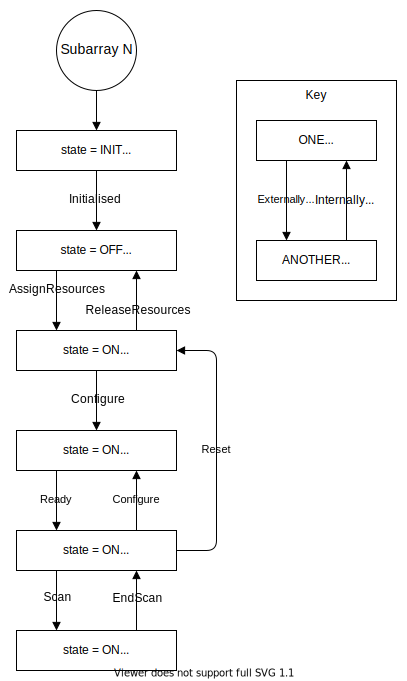

SDP Subarray Device
===================

Introduction
------------

The SDP subarray Tango device is the principal means by which processing is
initiated in the SDP.

State Model
-----------

The present implementation is shown in the diagram below. Here the state is the
combination of the Tango device state and the observing state (obsState).

Behaviour
---------

The interaction between the Telescope Monitoring and Control (TMC) system and
the SDP subarray device is shown below. The SDP subarray device receives
commands from the TMC subarray device, and the consequent changes to the state
of the SDP are reported in the device attributes.

.. image:: images/sdp_subarray_interaction_tango.svg
   :align: center

Attributes
----------

================ ======= ========== =========================== ===========
Attribute        Type    Read/Write Values                      Description
================ ======= ========== =========================== ===========
version          String  Read       Semantic version            Subarray device server version
---------------- ------- ---------- --------------------------- -----------
obsState         Enum    Read       :ref:`subarray_obsstate`    Subarray observing state
---------------- ------- ---------- --------------------------- -----------
adminMode        Enum    Read-write :ref:`subarray_adminmode`   Subarray admin mode
---------------- ------- ---------- --------------------------- -----------
healthState      Enum    Read       :ref:`subarray_healthstate` Subarray health state
---------------- ------- ---------- --------------------------- -----------
receiveAddresses String  Read       JSON object                 Host addresses for receiving visibilities
---------------- ------- ---------- --------------------------- -----------
scanType         String  Read                                   Scan type, or 'null' if scan type is not configured
---------------- ------- ---------- --------------------------- -----------
scanID           Integer Read                                   Scan ID, or 0 if not scanning
================ ======= ========== =========================== ===========

.. _subarray_obsstate:

obsState values
^^^^^^^^^^^^^^^

=============== ===========
obsState        Description
=============== ===========
EMPTY (0)       No receive and real-time processing resources are assigned to the subarray
--------------- -----------
RESOURCING (1)  Resources are being assigned or released
--------------- -----------
IDLE (2)        Receive and real-time processing resources are assigned to the subarray as specified in the execution block
--------------- -----------
CONFIGURING (3) Scan type is being configured
--------------- -----------
READY (4)       Scan type is configured and the subarray is ready to scan
--------------- -----------
SCANNING (5)    Scanning
--------------- -----------
ABORTING (6)    Current activity is being aborted
--------------- -----------
ABORTED (7)     Most recent activity has been aborted
--------------- -----------
RESETTING (8)   Resetting to IDLE obsState
--------------- -----------
FAULT (9)       A fault has occurred in observing
--------------- -----------
RESTARTING (10) Restarting in EMPTY obsState
=============== ===========

.. _subarray_adminmode:

adminMode values
^^^^^^^^^^^^^^^^

=============== ===========
adminMode       Description
=============== ===========
OFFLINE (0)
--------------- -----------
ONLINE (1)
--------------- -----------
MAINTENANCE (2)
--------------- -----------
NOT_FITTED (3)
--------------- -----------
RESERVED (4)
=============== ===========

.. _subarray_healthstate:

healthState values
^^^^^^^^^^^^^^^^^^

============ ===========
healthState  Description
============ ===========
OK (0)
------------ -----------
DEGRADED (1)
------------ -----------
FAILED (2)
------------ -----------
UNKNOWN (3)
============ ===========

Commands
--------

================ ============= =========== ======
Command          Argument type Return type Action
================ ============= =========== ======
On               None          None        Sets the device state to ON and obsState to EMPTY.
Off              None          None        Sets the device state to OFF.
AssignResources  String (JSON) None        :ref:`Assigns processing resources to the subarray. Sets obsState to IDLE <subarray_assign_resources>`.
ReleaseResources None          None        Releases all real-time processing in the subarray. Sets obsState to EMPTY.
Configure        String (JSON) None        :ref:`Configures scan type for the following scans. Sets obsState to READY <subarray_configure>`.
Scan             String (JSON) None        :ref:`Begins a scan of the configured type. Sets obsState to SCANNING <subarray_scan>`.
EndScan          None          None        Ends the scan. Sets obsState to READY.
End              None          None        Clears the scan type. Sets obsState to IDLE.
Abort            None          None        Aborts current activity. Sets obsState to ABORTED.
ObsReset         None          None        Resets to last known stable state. Sets obsState to IDLE.
Restart          None          None        Restarts the subarray device. Sets obsState to EMPTY.
================ ============= =========== ======

Command schemas and transaction IDs
^^^^^^^^^^^^^^^^^^^^^^^^^^^^^^^^^^^

The AssignResources, Configure and Scan commands take an argument which
contains configuration data in JSON format. The data are described by a schema
which is versioned to support evolution of the interfaces. The schema is
specified in the argument with the ``interface`` keyword:

.. code-block:: json

    {
      "interface": "https://schema.skao.int/ska-sdp-<command>/<version>",
      "transaction_id": "txn-test-20210809-00000000",
      "...": "..."
    }

where:

- ``<command>`` is ``assignres``, ``configure`` or ``scan``, and
- ``<version>`` is the version of the schema.

The argument is validated against the schema using the `telescope model library
<https://developer.skao.int/projects/telescope-model/en/latest/>`_. Its
documentation describes the versions of the schemas. The present implementation
of the subarray device supports versions 0.2 and 0.3 of the schemas. If a
command does not have an ``interface`` value, it defaults to version 0.2 for
backwards compatibility (this was the last version before ``interface`` values
were used routinely). The latest version of the schema is 0.3, which is used in
the examples in the following sections.

The example above also shows the optional transaction ID which can be passed to
a command. This is used in logging to enable tracing the execution of a
command. If the argument does not contain a transaction ID, then an internal
one is generated for the command. This is also done for all commands that do
not take an argument.

.. _subarray_assign_resources:

AssignResources command
^^^^^^^^^^^^^^^^^^^^^^^

The argument of the AssignResources command describes the processing to be done
for the execution block (EB). It contains a list of scan types and a list of
processing blocks. The scan types contain information about the frequency
channels in the output of the Correlator Beam Former (CBF), which is important
for configuring the receive workflow in the SDP. The processing blocks define
the workflows to be run and the parameters to be passed to the workflows.

An example of the argument is below. Note that:

- ``max_length`` specifies the maximum length of the execution block in
  seconds.
- In ``scan_types``, the channel information is for example only.
- In ``processing_blocks``, the workflow parameters will not actually be empty.
  Each workflow will have its own schema for its parameters.

.. code-block:: json

    {
      "interface": "https://schema.skao.int/ska-sdp-assignres/0.3",
      "eb_id": "eb-test-20210809-00000",
      "max_length": 21600.0,
      "scan_types": [
        {
          "scan_type_id": "science",
          "channels": [
            {"count": 372, "start": 0, "stride": 2, "freq_min": 0.35e9, "freq_max": 0.358e9, "link_map": [[0,0], [200,1]]}
          ]
        },
        {
          "scan_type_id": "calibration",
          "channels": [
            {"count": 372, "start": 0, "stride": 2, "freq_min": 0.35e9, "freq_max": 0.358e9, "link_map": [[0,0], [200,1]]}
          ]
        }
      ],
      "processing_blocks": [
        {
          "pb_id": "pb-test-20210809-00000",
          "workflow": {"kind": "realtime", "name": "test_receive_addresses", "version": "0.3.6"},
          "parameters": {}
        },
        {
          "pb_id": "pb-test-20210809-00001",
          "workflow": {"kind": "realtime", "name": "test_realtime", "version": "0.2.5"},
          "parameters": {}
        },
        {
          "pb_id": "pb-test-20210809-00002",
          "workflow": {"kind": "batch", "name": "test_batch", "version": "0.2.5"},
          "parameters": {},
          "dependencies": [
            {"pb_id": "pb-test-20210809-00000", "kind": ["visibilities"]}
          ]
        },
        {
          "pb_id": "pb-test-20210809-00003",
          "workflow": {"kind": "batch", "name": "test_batch", "version": "0.2.5"},
          "parameters": {},
          "dependencies": [
            {"pb_id": "pb-test-20210809-00002", "kind": ["calibration"]}
          ]
        }
      ]
    }

.. _subarray_configure:

Configure command
^^^^^^^^^^^^^^^^^

The argument of the Configure command specifies the scan type for the following
scans.

An example of the argument:

.. code-block:: json

    {
      "interface": "https://schema.skao.int/ska-sdp-configure/0.3",
      "scan_type": "science"
    }

Another example of the argument with the optional ``new_scan_types`` keyword.
This declares new scan types to add the ones already defined for the execution
block. This would be only supported by special receive workflows that can
handle dynamic reconfiguration of the receive processes.

.. code-block:: json

    {
      "interface": "https://schema.skao.int/ska-sdp-configure/0.3",
      "new_scan_types": [
        {
          "scan_type_id": "new_calibration",
          "channels": [
            {"count": 372, "start": 0, "stride": 2, "freq_min": 0.35e9, "freq_max": 0.358e9, "link_map": [[0,0], [200,1]]}
          ]
        }
      ],
      "scan_type": "new_calibration"
    }

.. _subarray_scan:

Scan command
^^^^^^^^^^^^

The argument of the Scan command specifies the scan ID.

An example of the argument:

.. code-block:: json

    {
      "interface": "https://schema.skao.int/ska-sdp-scan/0.3",
      "scan_id": 1
    }
